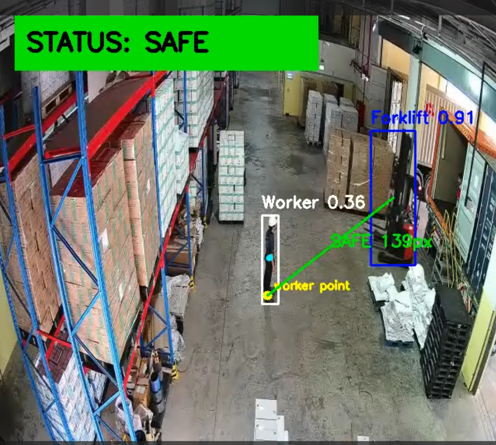

# 🚧 Forklift–Worker Safety Monitoring

Real-time **human–machine interaction safety monitoring** using a custom forklift detector and YOLO11s-Pose for worker localization.

This project detects forklifts and workers in industrial environments, estimates worker position using pose keypoints, calculates worker–forklift proximity, and classifies the interaction status as:

🟢 **SAFE**
🟡 **WARNING**
🔴 **DANGER**

---

## 📌 Demo

### Example Output



### Demo GIF


> Put your exported GIF or video preview inside the `assets/` folder.

---

## 🎯 Project Goal

Forklifts are one of the most common sources of safety risk in warehouses, factories, and logistics sites.
This project provides a computer-vision-based spatial awareness system that monitors worker–forklift interaction in real time.

The system can be used as a prototype for:

* Forklift–worker proximity monitoring
* Human–machine interaction risk analysis
* Industrial site safety awareness
* Smart factory surveillance
* Warehouse safety monitoring

---

## 🧠 Method Overview

The system uses two models:

| Module             | Model             | Purpose                           |
| ------------------ | ----------------- | --------------------------------- |
| Forklift Detection | Custom YOLO model | Detect forklift bounding boxes    |
| Worker Detection   | YOLO11s-Pose      | Detect workers and body keypoints |

The worker position is estimated using pose keypoints:

1. Use ankle keypoints if visible.
2. If ankles are missing, use hip keypoints.
3. If pose keypoints are incomplete, use the person bounding box bottom-center.

Then the system calculates the distance between the worker anchor point and the forklift bounding box.

---

## ⚙️ Safety Logic

```text
Worker anchor point ↔ Forklift bounding box distance
```

Risk classification:

```text
distance <= danger threshold   → DANGER
distance <= warning threshold  → WARNING
distance > warning threshold   → SAFE
```

Default thresholds:

```python
DANGER  <= 200 px
WARNING <= 400 px
SAFE    > 400 px
```

These values should be tuned for each camera angle and environment.

---

## ✨ Features

* 🚜 Forklift detection using a custom YOLO model
* 🧍 Worker detection using YOLO11s-Pose
* 🦴 Pose keypoint visualization
* 📏 Worker–forklift distance calculation
* 🟢 SAFE / 🟡 WARNING / 🔴 DANGER classification
* 🎥 Video input support
* 🖼️ Image input support
* 💾 Automatic output saving
* ⚡ Real-time OpenCV visualization

---

## 📁 Repository Structure

```text
forklift-worker-safety-monitoring/
│
├── monitoring_worker_forklift.py
├── requirements.txt
├── README.md
├── LICENSE
│
├── weights/
│   └── best.pt
│
├── assets/
│   ├── demo_image.png
│   └── demo.gif
│
├── videos/
│   └── test.mp4
│
└── outputs/
    └── result.mp4
```

---

## 🛠️ Installation

### 1. Clone the repository

```bash
git clone https://github.com/YOUR_USERNAME/forklift-worker-safety-monitoring.git
cd forklift-worker-safety-monitoring
```

### 2. Create environment

```bash
conda create -n forklift_safety python=3.12 -y
conda activate forklift_safety
```

### 3. Install dependencies

```bash
pip install -r requirements.txt
```

---

## 📦 Requirements

Create `requirements.txt`:

```text
ultralytics
opencv-python
numpy
torch
torchvision
```

For GPU acceleration, install the correct PyTorch version for your CUDA environment.

---

## 🚀 Usage

### Run with default video

```bash
python monitoring_worker_forklift.py
```

### Run with custom video

```bash
python monitoring_worker_forklift.py --source "videos/test.mp4"
```

### Run with custom image

```bash
python monitoring_worker_forklift.py --source "assets/test_image.jpg"
```

### Change thresholds

```bash
python monitoring_worker_forklift.py --warning-dist 400 --danger-dist 200
```

### Use custom forklift model

```bash
python monitoring_worker_forklift.py --forklift-weights "weights/best.pt"
```

---

## 🖼️ Output

The system automatically saves processed results inside:

```text
outputs/
```

Example:

```text
outputs/forklift_worker_pose_safety_20260625_153020.mp4
```

For image input, output can be saved as:

```text
outputs/forklift_worker_pose_safety_20260625_153020.jpg
```

---

## 🔍 Algorithm

### Step 1: Forklift Detection

The custom YOLO model detects the forklift region:

```text
Forklift → bounding box
```

### Step 2: Worker Pose Detection

YOLO11s-Pose detects workers and body keypoints:

```text
Worker → bounding box + pose keypoints
```

### Step 3: Worker Anchor Point

The worker location is estimated using lower-body keypoints:

```text
ankles → hips → bbox bottom-center
```

### Step 4: Distance Calculation

The system calculates the shortest distance from the worker anchor point to the forklift bounding box.

### Step 5: Risk Classification

```text
SAFE / WARNING / DANGER
```

The highest-risk worker–forklift pair controls the global frame status.

---

## 📊 Example Result

```text
Forklift confidence: 0.74
Worker confidence: 0.92
Distance: 342 px
Status: WARNING
```

---

## 📚 Sources / Technologies

This project uses:

* Python
* OpenCV
* Ultralytics YOLO
* PyTorch
* Custom YOLO forklift detector

---

## ⚠️ Privacy and Safety Notice

When using real industrial CCTV footage, make sure that:

* You have permission to use and share the video.
* Faces, company names, and sensitive workplace information are anonymized when needed.
* The system is used as a safety-support tool, not as the only decision-making system.

---

## 📄 License

This repository is released under the MIT License.

```text
MIT License
Copyright (c) 2026 YOUR_NAME
```

Check third-party model and library licenses separately before commercial deployment.

---

## 👤 Author

**Azimjon Akhtamov**
AI Researcher / Computer Vision Developer

GitHub: https://github.com/azimjaan21
LinkedIn: https://www.linkedin.com/in/azimjaan21

---

## ⭐ Support

If this project is useful, please consider giving the repository a star ⭐.
